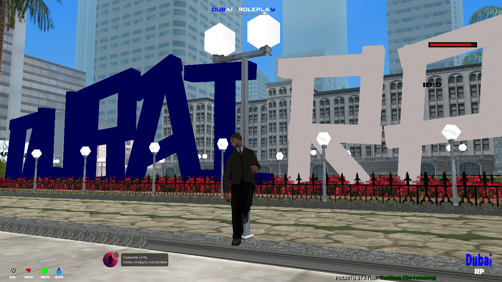

<div align="center">

# DUBAI ROLEPLAY V2

### A complete, production-oriented roleplay framework engineered for open.mp

[](https://www.open.mp/)
[](https://github.com/pBlueG/SA-MP-MySQL)
[](#credits)
[](https://github.com/najuaircrack/AKRP-V5)

<br><br>



<sub>In-game preview from the official Dubai Roleplay V2 environment</sub>

</div>

---

## About

**Dubai Roleplay V2** is a complete roleplay framework developed for open.mp with the objective of bringing a more modern, FiveM-inspired gameplay experience into the Pawn ecosystem. It represents an extensively developed server foundation in which progression, world interaction, interface design, administration, and persistent data operate as a single connected environment. The project is intended for communities that require more than a conventional starter gamemode and for developers seeking an established platform that can be adapted without rebuilding every fundamental system from the beginning.

The gamemode is structured around a persistent MySQL-backed world. Player identities, organizations, vehicles, properties, businesses, inventories, progression, territory ownership, and economic activity are maintained as interconnected records rather than temporary or isolated mechanics. This approach gives server administrators the flexibility to operate and expand the environment through in-game workflows while allowing developers to extend the underlying systems through a clearly established codebase.

Its player experience is distinguished by customized textdraw interfaces, animated notifications, structured dialogs, a FiveM-inspired world-marking system, and a progression-focused grinding model. Advanced turf controllability provides a substantial competitive framework for organizations through influence, capture states, alliances, configurable security conditions, rewards, locking controls, and persistent territory storage. A fully dynamic showroom complements this design with configurable dealerships, categorized vehicle selections, visual previews, managed pricing, and in-game operational control.

The technical foundation makes extensive use of hooks, callback-driven services, threaded MySQL operations, streamed world entities, modular subsystems, Discord connectivity, configurable anti-cheat controls, and detailed administrative tooling. These systems allow Dubai Roleplay V2 to function both as a deployable roleplay server and as an extensible development framework. Communities are free to preserve its existing direction or transform it into an entirely different experience while retaining a stable and feature-complete base.

Dubai Roleplay V2 originated from **[AKRP V5](https://github.com/najuaircrack/AKRP-V5), created by [najuaircrack](https://github.com/najuaircrack)**. That original foundation remains properly acknowledged. Through extensive rescripting, interface development, system expansion, operational improvements, and open.mp-focused engineering, the project evolved into the distinct release presented in this repository.

## Installation

1. Download or clone this repository.
2. Create a MySQL or MariaDB database.
3. Import [`databases/Clean.sql`](databases/Clean.sql).
4. Enter the database credentials in `mysql.ini`.
5. Configure the server, RCON password, and Discord token in `config.json`.
6. Compile `gamemodes/Dubai-V2.pwn` and place the resulting AMX in `gamemodes/`.
7. Set `pawn.main_scripts` in `config.json` to the compiled gamemode name.
8. Start the open.mp server.

```ini
hostname = 127.0.0.1
username = your_database_user
password = your_database_password
database = dubai_v2
server_port = 3306
```

> Do not publish database passwords, Discord tokens, RCON passwords, or other production credentials.

## Credits

| Contributor | Contribution |
|---|---|
| **[najuaircrack](https://github.com/najuaircrack)** | AKRP V5 original base |
| **NeeLan ICNQ / NeelanX** | Rescripting, development, and textdraws |
| **WROX / WroxExM / ZpyRx** | Development, systems, dynamic showroom, and textdraws |
| **Razi / RaziScofield** | Gamemode and server development |

Credits belonging to open.mp and the authors of all third-party plugins, includes, libraries, and mappings must be preserved.

## From the developer

Dubai Roleplay V2 was developed in an environment founded on trust, loyalty, and a shared commitment to the project. When those principles were no longer mutual, preserving the source as a private asset served no legitimate purpose. This release establishes the definitive public record of the work, its origin, and the people who contributed to it.

Anyone is welcome to study, operate, modify, or extend this code under the terms of its license. What should never be confused with development, however, is the act of removing attribution and presenting another person's work as an original achievement. A changed name or version number does not rewrite authorship; the source history speaks with greater authority than any claim made after it.

Use this project as a foundation if it has value to you. Improve it substantially, respect where it came from, and create something you are prepared to sign your own name to. Serious developers are recognized by what they build, not by what they attempt to claim.

> **The source is public. The record is permanent. The standard is simple: build work that can stand on its own.**

## License

Released under the [MIT License](LICENSE). This official release may be used, modified, and distributed under the license terms with the required copyright and permission notice preserved. Third-party dependencies may use separate licenses.

---

<div align="center">

**Dubai Roleplay V2 - released by the developers, not the sellers.**

</div>
